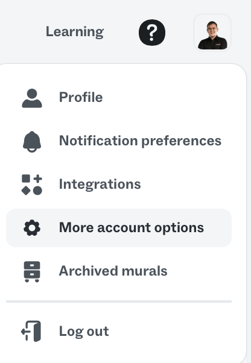
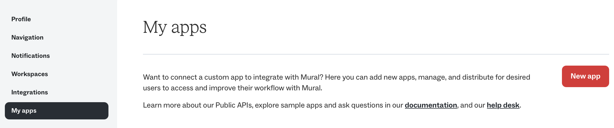
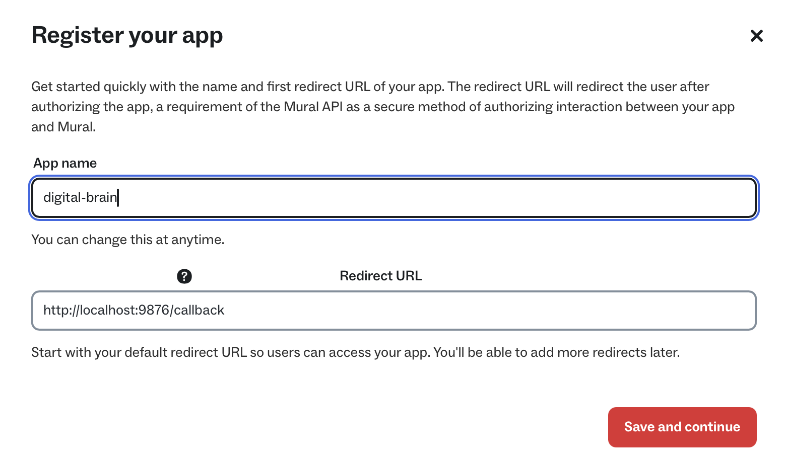
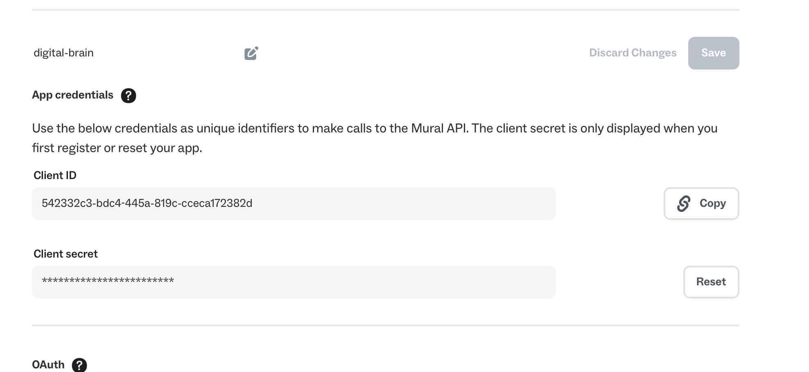
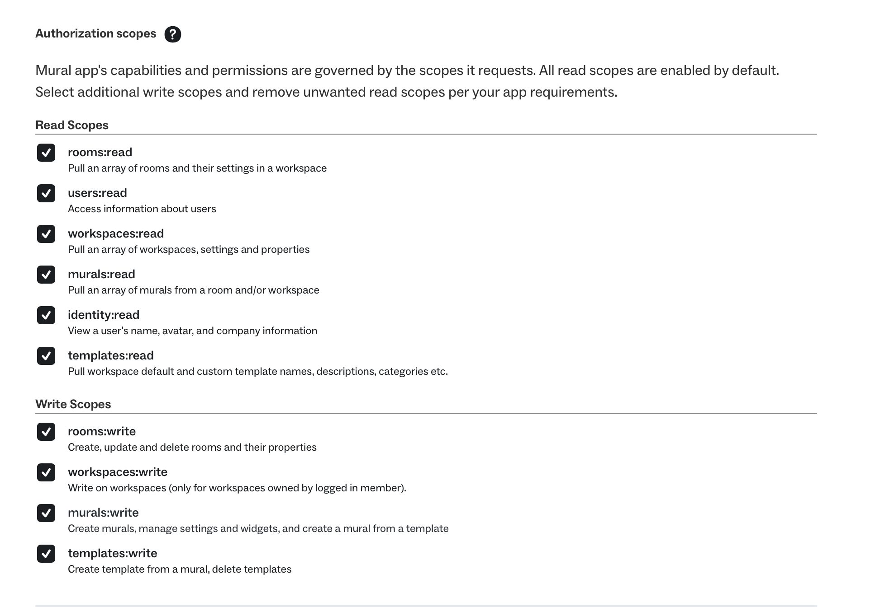

# mural-mcp

Mural board management for Claude Code via MCP. Extract, update, create, and query Mural boards directly from your Claude Code sessions.

## Features

- **List boards** — browse boards by workspace or room, search by title
- **List rooms** — discover rooms within a workspace
- **Extract** — fetch full board content as structured JSON
- **Summary** — get a compact overview (areas, widget counts, tags)
- **Query** — filter widgets by area, type, or text content
- **Update** — sync changes to a board (desired-state or explicit operations)
- **Create** — create new boards with templates or custom specs

## Prerequisites

- Node.js >= 22
- A Mural account with API access
- A Mural OAuth app (client ID + secret)

## Creating a Mural OAuth App

### Step 1: Open account settings

Click your profile icon in the top-right corner of Mural and select **More account options**.



### Step 2: Navigate to My Apps

In the settings sidebar, click **My apps**, then click the **New app** button.



### Step 3: Register your app

Fill in:
- **App name** — any name you like (e.g., `claude-mural`)
- **Redirect URL** — must be exactly: `http://localhost:9876/callback`

Click **Save and continue**.



### Step 4: Copy your credentials

After saving, you'll see your **Client ID** and **Client Secret**. Copy both — the client secret is only shown once (you can reset it later if needed).



### Step 5: Configure scopes

Enable the following scopes for full functionality:

**Read Scopes** (all enabled by default):
- `rooms:read`
- `users:read`
- `workspaces:read`
- `murals:read`
- `identity:read`
- `templates:read`

**Write Scopes** (enable these):
- `rooms:write`
- `workspaces:write`
- `murals:write`
- `templates:write`



Click **Save** when done.

## Installation

### As a Claude Code Plugin

Add the marketplace and install:

```bash
/plugin marketplace add https://github.com/philippgehrig/mural-mcp.git
/plugin install mural
```

During installation you'll be prompted for:
- **Mural OAuth Client ID** — from Step 4 above
- **Mural OAuth Client Secret** — from Step 4 above
- **Default workspace** (optional) — auto-detected from board URLs if not set

### Manual MCP Configuration

Add to your `~/.claude/.mcp.json`:

```json
{
  "mcpServers": {
    "mural": {
      "command": "node",
      "args": ["/path/to/mural-mcp/dist/index.js"],
      "env": {
        "MURAL_CLIENT_ID": "your-client-id",
        "MURAL_CLIENT_SECRET": "your-client-secret"
      }
    }
  }
}
```

## Authentication

On first use, the plugin opens your browser for OAuth authorization. The token is cached at `~/.mural-mcp/token.json` and reused until expiry.

If authentication expires, the next tool call will automatically trigger a fresh OAuth flow.

## Available Tools

| Tool | Description |
|------|-------------|
| `mural_list_boards` | List or search boards by workspace/room, with optional title filter |
| `mural_list_rooms` | List rooms in a workspace |
| `mural_extract_board` | Fetch all widgets from a board as structured JSON |
| `mural_summary` | Get area names, widget counts, and tags |
| `mural_query_widgets` | Filter widgets by area, type, or text |
| `mural_update_board` | Apply changes (desired-state diff or explicit create/update/delete) |
| `mural_create_board` | Create a new board with initial content |

## Development

```bash
npm install
npm run build
npm run dev      # run with tsx (no build needed)
npm test         # run tests
```

## Environment Variables

| Variable | Description | Default |
|----------|-------------|---------|
| `MURAL_CLIENT_ID` | OAuth app client ID | (required) |
| `MURAL_CLIENT_SECRET` | OAuth app client secret | (required) |
| `MURAL_WORKSPACE` | Default workspace ID | (auto-detected) |
| `MURAL_CALLBACK_PORT` | OAuth callback port | `9876` |

## License

MIT
